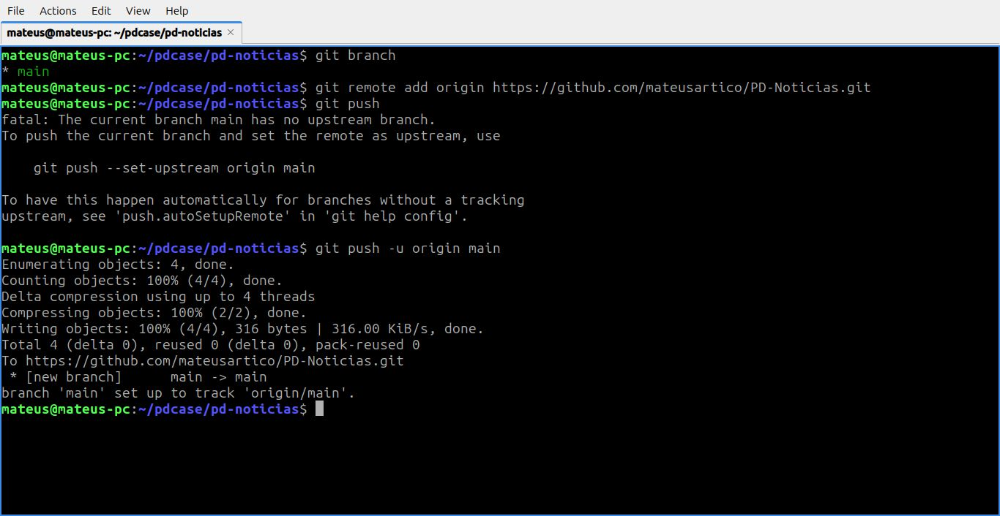
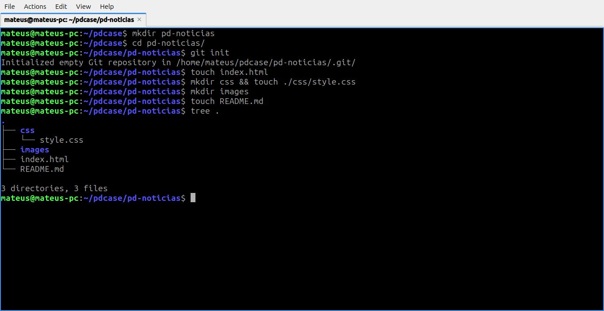

# PD Noticias

## Descrição do Projeto

O **PD Noticias** é um site interno desenvolvido para a empresa PD Case, com o objetivo de divulgar atualizações, prêmios, feriados, curiosidades e outras informações de interesse geral dos colaboradores.

O projeto foi desenvolvido em **HTML** e **CSS**, seguindo uma estrutura organizada em pastas e utilizando **Git e GitHub** para o controle de versão.

---

## Funcionalidades

- Cabeçalho e navegação principal
- Notícias em destaque e artigos informativos
- Seção com avisos e links relacionados
- Rodapé com informações institucionais

---

## Branchs Criadas

- `feat/header (Mateus)`
- `feat/main (Roger)`
- `feat/article (Roger)`
- `feat/aside (Roger)`
- `feat/footer (Mateus)`
- `feat/nav (Mateus)`
- `docs/readme (Roger)`
- `style/first-style (Mateus e Roger)`
- `style/footer (Mateus)`

---

## Processo de Criação do Repositório, Commits e PRs

**Print 1:** Criação do repositório local

**Print 2:** Primeiro commit realizado

**Print 3:** Primeiro Pull Request aberto

__

---

## Tecnologias Utilizadas

- **HTML5**
- **CSS3**
- **Git**
- **GitHub**

---

## Autores

- **Mateus Coelho**
- **Roger Leal**
